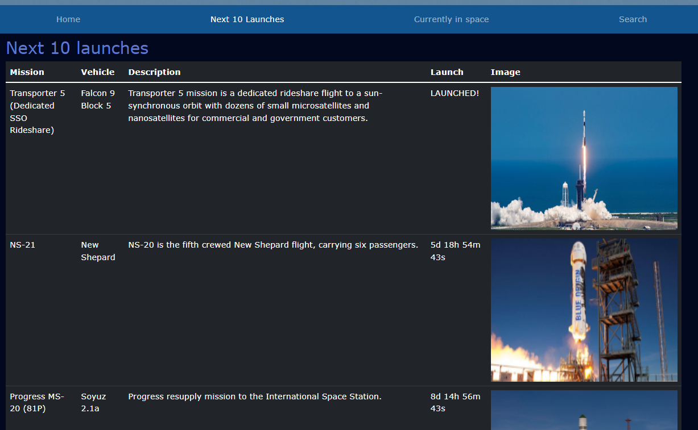

Sampsa Leikas
============

Github: [https://github.com/sampsale](https://github.com/sampsale)

Email: sampsaleikas@gmail.com 

Phone: 0404111432

Koulutus
---------

    
:   **Haaga-Helia University of Applied Sciences, IT-Tradenomi**: 2016-2017, 2020-2022

    Oleellista kurssien sisältöä
    1. Ohjelmoinnin perusteet (Java ja JS)
    2. Käyttöliittymän suunnittelu (React)
    3. Front-end (React)
    4. Mobiiliohjelmointi (React-native)
    5. Palvelinohjelmointi (Java + Springboot)
    6. Blender perusteet
    7. Relaatiotietokannat ja SQL
    8. Ohjelmistoprojekti tiimissä (React, SQL, SpringBoot)
    9. Basics of AI (Data parsing, Power BI)
    10. Linux palvelimet (Linux perusteet, domain, palvelimet)
    11. Windows palvelimet (domain, palvelimet)
    12. Python Programming (Python perusteet)
    13. AI with Python (Regressiomallit, yleinen AI)
    14. Microsoft Azure Fundamentals (AWS)

## Työkokemus

**Gigantti** 08/2017-09/2019

Asiakaspalvelu ja myynti (chat/puhelin/sähköposti/some) sekä yksityis- että b2b-asiakkaille, kirjanpito, vakuutusvaihdot, logistiikan ohjaus, yhteydenpito konsernin sisällä (Suomi + muu Eurooppa) ja yhteistyökumppanien kanssa (valmistajat, kuljetus- ja huoltoliikkeet, yms)  

**Yleisradio** 02/2021-04/2021, 06/2021-08/2021, 03/2022-12/2022 (osa-aika)

2012: Nettimateriaalin luokittelu, editointi ja syöttäminen sivuille. 2021: Kielten oppimisten sivujen ja nettitehtävien korjaamista ja siirtämistä uuteen formaattiin. Sosiaalisen median moderointi (Twitter, Instagram, Facebook). 2022: Digitreenien päivittäminen

### Muu työkokemus

**Kansaneläkelaitos:** 02/2020-05/2020:
Etuuskäsittelijä -- 
Tulevien hakemusten ja muun postin avaaminen, lajittelu ja ohjaaminen oikealle osastolle

**Verohallinto:** 06/2017-07/2017:
Tallentaja -- 
Veroilmoitusten digitalisointi

**Posti:** 12/2015, 03/2016, 06/2016-08/2016 (osa-aika):
Lajittelija -- 
Postinumeroiden lukeminen ja tallentaminen koneelle, lajittelua	

**Valio:** 07/2013-08/2013, 03/2014-08/2014 ja 05/2015-08/2015:
Prosessivastaava --
Teollisuustuotannon ohjaus, laitteiden valvonta, logistiikka, laaduntarkkailu, toimintaohjeiden laatiminen, perehdyttäminen

## Tekniikat

:   **JavaScript:**
    Sujuva. Tekniikoita: useita pieniä kirjastoja, D3, React

:   **HTML:** 
    Sujuva

:   **CSS:**
    Sujuva. Tekniikoita: BootStrap

:   **SQL:**
    Perusteet

:   **Python:** 
    Sujuva. Tekniikoita: useita pieniä kirjastoja, Django, Pygame, Matplotlib

:   **Java:**
    Perusteet

:   **Git:**
    Perusteet

## Extra 

* Erityiset kiinnostuksenkohteet: APIt, big data, optimointi, tietokannat.  

* Ihmiskielet:

     * Suomi (äidinkieli) 
     * Englanti (sujuva)

## Tehtyjä projekteja [GitHubissa](https://github.com/sampsale)
<ul>
  <li><b>Space Launches:</b> Javascript, HTML, CSS, Bootstrap:  Tulevat avaruuslaukaisut ja muuta tietoa avaruudesta; ISS-sijainti kartalla (GoogleMaps API), avaruudessa olevat henkilöt, hakuja eri avaruusaiheisille asioille. Paljon datan käsittelyä JSON-muodossa ja käyttöliittymän tekemistä. Mobiiliystävällinen. <b>HUOM:</b> kaikki API-avaimet eivät ole tallennettu GitHubiin. <a href="https://github.com/sampsale/SpaceLaunches">Link</a>
  
  </li>
  <li><b>Weather-app:</b> React-native, Expo: Sää-sovellus, joka ilmoittaa sään sijainnissassi tai tallentamissassi sijainneissa valinnan mukaan. Antaa tiettyihin kellonaikoihin push-notifikaation, mutta ikävä kyllä tämä toiminnallisuus on tällä hetkellä buginen. <a href="https://github.com/sampsale/WeatherApp">Link</a></li>
  <li><b>Useita projekteja koulusta: </b><a href="https://github.com/sampsale">GitHubistani</a> löytyy useampi projekti, joita tehty koulutehtävinä: Linux-palvelimet kurssi, jossa tarkka raportointi palvelimen asentamisesta Linuxille ja domainin ostamisesta. PersonalTrainer app, joka tehty Reactia ja MUI:ta käyttäen. VisitedCountries, tehty Javalla, tekniikoina SpringBoot ja Thymeleaf. </li>
  <li><b>Itsenäisesti opiskeltuja juttuja: </b><a href="https://github.com/sampsale/PythonCrashCourse">Python Crash Course</a>, <a href="https://fullstackopen.com/">FullStackOpen</a> ja useita satunnaisia projekteja (web scraperit, D3, yms). 
  </li>
 
</ul>