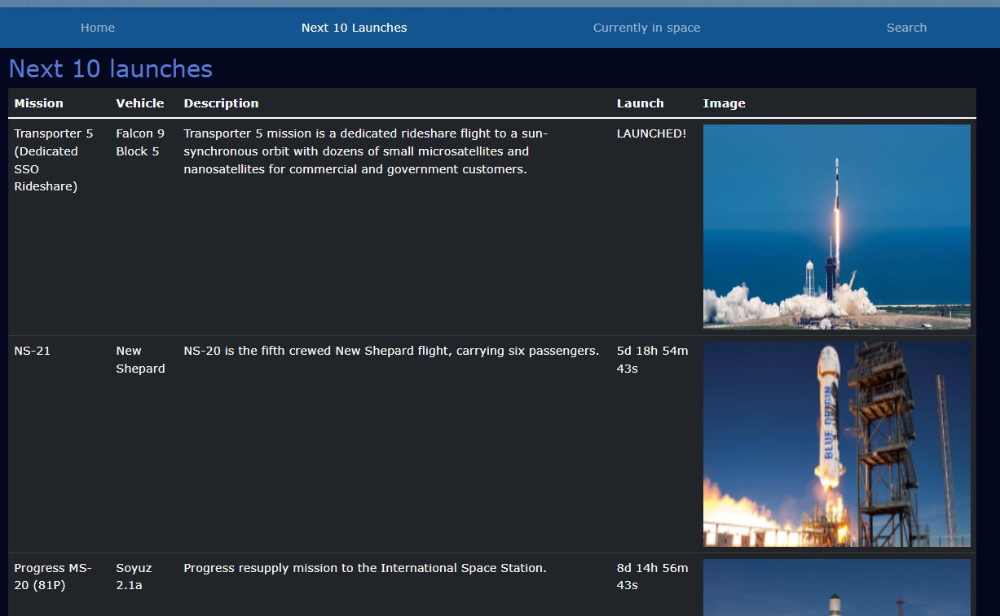

Sampsa Leikas
============

Education
---------

    
**Haaga-Helia University of Applied Sciences, Degree Programme in Business Information Technology**: 2016-2017, 2020-2022

    Relevant courses
    1. Orientation to Software Engineering (Java and JS)
    2. React.js fundamentals(React)
    3. Front-end (React)
    4. Mobile programming (React-native)
    5. Server programming (Java + Springboot)
    6. Blender basics
    7. Relational databases and SQL
    8. Software project in a team (React, SQL, SpringBoot)
    9. Basics of AI (Data parsing, Power BI)
    10. Linux server (Linux basics, domain, servers)
    11. Windows server (Domain, servers)
    12. Python Programming (Python basics)
    13. AI with Python (Regression models, basics of AI)
    14. Microsoft Azure Fundamentals (AWS)

## Work experience

**Kansaneläkelaitos** Data Engineer 05/2023-

Processing and developing Kanta data for end use. The end users are typically institutions like THL (Finnish Institute for Health and Welfare) or other research organizations. The work involves handling big data, where various raw documents are processed, parsed, and otherwise transformed into a format that is easy to handle. The job requires strong proficiency in SQL query language and Python, as well as integrating various information systems. The tools in use include various Apache Software systems such as the Hadoop ecosystem, cluster computing, extensive use of data frames, and, of course, native Python along with numerous libraries.

**Gigantti** 08/2017-09/2019

Customer service and sales (chat/phone/email/social media) to B2C- and B2B-customers, bookkeeping, insurance exchanges, logistical oversight, internal communications within the company (Finland + Europe) and with partners (manufacturers, delivery- and maintenance companies, etc) 

**Yleisradio** 02/2021-04/2021, 06/2021-08/2021, 03/2022-12/2022 (part-time)

2012: Editing and inputting incoming data 
2021: Updating and migrating Yle Learning assignments and learning articles to a new platform, social media moderation (Twitter, IG, FB)
2022: Updating the contents of Digitreeni-articles, meant to help people with digital devices and software 

### Other experience

**Kansaneläkelaitos:** 02/2020-05/2020:
Benefits Officer  -- 
Opening, sorting, and redirecting incoming applications and other mail

**Verohallinto:** 06/2017-07/2017:
Digitization of tax returns

**Posti:** 12/2015, 03/2016, 06/2016-08/2016 (part-time):
Mail Sorter -- 
Digital and physical sorting of incoming mail

**Valio:** 07/2013-08/2013, 03/2014-08/2014 ja 05/2015-08/2015:
Process Manager --
Oversight and maintenance of industrial machinery, logistics, quality control, documentation

## Techniques

**JavaScript**
Fluent. Techniques: multiple small libraries, D3, React

**HTML**
Fluent

**CSS**
Fluent

**SQL**
Fluent

**Python**
Fluent. Techniques: multiple libraries and frameworks. Specialized in frameworks related to data parsing and processing

**Java**
Basic knowledge

**Git**
Fluent

**Linux**
Debian & Ubuntu; fluent

Apache:
Airflow (DAG management), Hive, Impala, Hadoop ecosystem

* Special interests: APIs, big data, optimizing, databases RPA

* Human languages:

     * Finnish (native) 
     * English (fluent)

## Projects on [Github](https://github.com/sampsale)
<ul>
  <li><b>Guess the Year:</b> JQuery, Bootstrap. An application that displays a series of images and asks the user to guess the year they were taken. The project started as a "hobby project," but the Finnish Broadcasting Company (Yleisradio) became interested in purchasing it. Link to the deployed application <a href='https://yle.fi/aihe/a/20-10004793'>here</a>. The source code is now owned by Yleisradio, but the application is entirely my creation, excluding the non-programming content (images and captions).</li> 
  <li><b>Space Launches:</b> Javascript, HTML, CSS, Bootstrap:  Upcoming space launches and other information on space exploration; ISS-position on map (GoogleMaps API), people currently in space, search functions for several space related databases. Lots of JSON-data parsng and user interface considerations. Mobile friendly. <b>NB:</b> API-keys not on GitHub. 
  <a href="https://github.com/sampsale/SpaceLaunches">Link</a>
  
  </li>
  <li><b>Guess the Year:</b> JQuery, Bootstrap. App that gives you a series of photos from Finnish history and you'll have to guess what year they were taken. Link to repo <a href='https://github.com/sampsale/PhotoApp'>here</a> and to deployed app <a href='https://github.com/sampsale/PhotoApp'>here</a>.</li>
    
  <li><b>Weather-app:</b> React-native, Expo: Weather-app, that gives you the weather in your location or saved locations. Gives a push-notification at certain times, but sadly this feature is buggy at the moment. <a href="https://github.com/sampsale/WeatherApp">Link</a></li>
  <li><b>Ukraine war archive:</b> Made with Django + Bootstrap for styling. Archive for 11 000 Ukraine war related articles collected from a Finnish newspaper, sorted by month. Not in a public repo since I don't own the articles.</li>
  <li><b>Several school projects: </b>On my <a href="https://github.com/sampsale">GitHub</a> you'll find several projects, that have been completed as part of a school assignment. Linux-servers, with meticulous documentation on setting up a server and purchasing a domain. PersonalTrainer app, built with React using MUI. VisitedCountries, built with Java with SpringBoot and Thymeleaft.</li>
  <li><b>Studied independently: </b><a href="https://github.com/sampsale/PythonCrashCourse">Python Crash Course</a>, <a href="https://fullstackopen.com/">FullStackOpen</a>(work in progress) and several random projects (web scraping, D3, etc). Most of my repos are hidden due to incompleteness or little to no documentation. 
  </li> 
</ul>